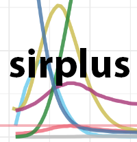
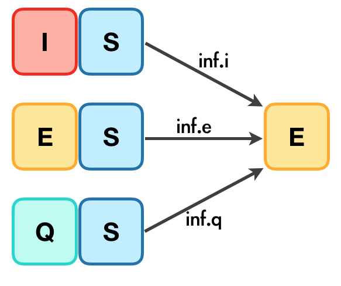

```{r setup, include=FALSE}
version_date <- lubridate::ymd("2020-04-12")
knitr::opts_chunk$set(echo = TRUE, cache=FALSE, eval=TRUE, collapse = TRUE,
                      tidy.opts=list(width.cutoff=60), tidy=FALSE)
```



The sirplus package makes it easy to generate stochastic individual compartment 
models (ICMs) first implemented by @Jenness2018-uf to simulate contagious disease spread using compartments not 
available in standard SIR model in the [EpiModel package](http://www.epimodel.org/). 

The extension to EpiModel was originally proposed by @Churches2020-df in his [blog post](https://timchurches.github.io/blog/posts/2020-03-18-modelling-the-effects-of-public-health-interventions-on-covid-19-transmission-part-2/).
The sirplus package has implemented the extended model building on [original code published by Tim Churches](https://gist.github.com/timchurches/92073d0ea75cfbd387f91f7c6e624bd7).

The sirplus package was developed by 
the Bioinformatics & Cellular Genomics team at St. Vincent's Institute of 
Medical Research in order to help St. Vincents' Hospital model the COVID-19
pandemic.

The compartments available in this package include: 

| Compartment | Functional definition                                                             |
|-------------|-----------------------------------------------------------------------------------|
| **S**           | Susceptible individuals                                                           |
| **E**           | Exposed **and** infected, not yet symptomatic but potentially infectious          |
| **I**           | Infected, symptomatic **and** infectious                                          |
| **Q**           | Infectious, but (self-)isolated                                                   |
| **H**           | Requiring hospitalisation (would normally be hospitalised if capacity available)  |
| **R**           | Recovered, immune from further infection                                          |
| **F**           | Case fatality (death due to infection, not other causes)                          |

The diagram below shows the model structure and how the parameters and compartments associate with each other. 
See Tim Churches's [blog post](https://timchurches.github.io/blog/posts/2020-03-18-modelling-the-effects-of-public-health-interventions-on-covid-19-transmission-part-2/) for more details. 


| Transitions  | Description     | Parameters (with default values)     |
|-------------|-----------------------------------------|-------------------------------------------|
| **inf**     | Infection due to contact with I, E and Q, which correspond to **inf.i**, **inf.e** and **inf.q** respectively.<br> (See the diagram below for more details)  | `act.rate.*` and `inf.prob.*`, where `*` = `i`, `e`, `q`  <br>(See table below for more details)      | 
| **prog**    | Progress from asymptomatic to symptomatic | `prog.rand = FALSE`, `prog.rate`, `prog.dist.scale = 5`, `prog.dist.shape = 1.5`  |    
| **quar**    | From infectious to quarantine      | `quar.rand = TRUE`, `quar.rate = 1/30`       | 
| **hosp**    | From infected (both before and during quarantine) to require hospitalisation  | `quar.rand = TRUE`, `quar.rate = 1/30`       | 
| **rec**    | From infected to recovered without hospitalization | `rec.rand = FALSE`, `prog.dist.scale = 35`, `prog.dist.shape = 1.5`       | 
| **arec**    | Exposed individuals recovered before symptomatic | `arec.rand = TRUE`, `arec.rate = 0.05` | 
| **disch**    |  recovery after hospitalization | `disch.rand = TRUE`, `disch.rate = 1/15` | 
| **fat**    |  Fatality | `fat.rate.base = 1/50`, `hosp.cap = 40`, `fat.rate.overcap = 1/25`, `fat.tcoeff = 0.5` | 

The **inf** transaction results from the contact of S with at least one of I, E and Q compartments, 
the three sub-transactions are described in the following diagram:   

<p align="center"> 

</p>

Each one of  **inf.i**, **inf.e** and **inf.q** are controlled by two parameters: <br>
- `act.rate.*` controls the number of the S that are in contact with * each day, <br>
- `inf.prob.*` controls the probability that S turns into E, given that S is in contact with *, <br>
where `*` is one of `i`, `e` and `q` respectively.

| Transitions  | Description     | Parameters (with default values)     |
|-------------|----------------------------| --------------------------------------------------------|
| **inf.i**     | Infection of S due to contact with I  | `act.rate.i = 10` and `inf.prob.i = 0.05`  | 
| **inf.e**     | Infection of S due to contact with E  | `act.rate.e = 10` and `inf.prob.e = 0.02`  | 
| **inf.q**     | Infection of S due to contact with Q  | `act.rate.q = 2.5` and `inf.prob.q = 0.02`  | 


## Simulate and inspect a baseline sirplus model

### Set parameters

Here we will simulate the epidemiological data for a made-up population with 1000 
susceptible individuals (S), 50 that are infected but not in the hospital or in 
self-quarantine (I; maybe people that are infected/symptomatic but not tested/
aware), 10 confirmed cases that have self-isolated (Q), and 1 confirmed case that
has been hospitalized (H). We call this the baseline model because it uses 
default parameters for disease spread (i.e. no additional interventions).

```{r, set parameters}
library(sirplus)
s.num <- 2000  # number susceptible
i.num <- 15  # number infected 
q.num <- 5  # number in self-isolation
h.num <- 1  # number in the hospital
sim_population <- s.num + i.num + q.num + h.num
nsteps <- 90 # number of steps (e.g. days) to simulate

control <- control_seiqhrf(nsteps = nsteps)
param <- param_seiqhrf()
init <- init_seiqhrf(s.num = s.num, i.num = i.num, q.num = q.num, h.num = h.num)

print(init)
print(control)
print(param)
```

### Simulate baseline

This will produce an seiqhrf object. 

```{r, run simulation}
baseline_sim <- seiqhrf(init, control, param)
baseline_sim
```

### Extract summary of the simulation

```{r, extract summary}
summary(baseline_sim)
ls.str(summary(baseline_sim))
```

### Inspect baseline transition distributions

The sirplus model controls transitions between compartments, i.e. a change in state for an individual (e.g. going from self-isolation to hospital), using a variety of 
transition parameters. You can use the `plot()` functions, and set parameter `method` as `times` 
to examine the distributions of timings for various transitions based
on these parameters. In the case of a disease with observed data available, these plots can be used to sanity check parameter settings.


```{r baseline sims, fig.height=8}
plot(baseline_sim, "times")
```

### Plot baseline sirplus results

To visualise your sirplus model, you can plot the change in prevalence 
(i.e. people) over time in each compartment. By default, this plotting 
function shows the mean count across all simulations and the 95th quantile in 
the ribbon. You can hide the CI by setting parameter `ci` to `FALSE`.

```{r viz prevalence}
plot(baseline_sim, 
     start_date = lubridate::ymd("2020-01-01"),
     comp_remove = c('s.num', 'r.num'), 
     plot_title = 'Baseline Model')
```

## Run an experiment

With the sirplus package you can also set up experiments. We will set up two
experiments here: 

- Experiment #1: One week after the beginning of the epidemic, schools and non-essential businesses are closed to encourage social distancing. This causes the act.rate to gradually drop from 10 to 6 over the course of the next week. In this experiment, we imagine these policies are never lifted, so act.rate remains at 6 for the duration of the simulation. 
- Experiment #2: Again, one week after the beginning of the epidemic, social distancing policies are put into place resulting in act.rate dropping from 10 to 6 over the next week. But after two weeks these policies are lifted and the act.rate returns to normal within the next week. 

```{r Experiment example with act.rate}
# Experiment #1
vals <- c(10, 7)
timing <- c(7, 14)
act_rate <- vary_param(nstep = nsteps, vals = vals, timing = timing)

control <- control_seiqhrf(nsteps = nsteps)
param <- param_seiqhrf(act.rate.e = act_rate, act.rate.i = act_rate * 0.5)
init <- init_seiqhrf(s.num = s.num, i.num = i.num, q.num = q.num, h.num = h.num)
sim_exp <- seiqhrf(init, control, param)

# Experiment #2
vals <- c(10, 7, 7, 10)
timing <- c(7, 14, 21, 28)
act_rate_relax <- vary_param(nstep = nsteps, vals = vals, timing = timing)

param <- param_seiqhrf(act.rate.e = act_rate_relax, act.rate.i = act_rate_relax * 0.5)
sim_exp_relax <- seiqhrf(init, control, param)

# Compare experiments 1 and 2 to the baseline simulation
plot(list("Baseline" = baseline_sim, "Closures" = sim_exp, 
          "Closures (2 mo)" = sim_exp_relax),
     start_date = lubridate::ymd("2020-01-01"), 
     comp_remove = c('s.num', 'r.num'), plot_title = 'Closures Experiment')
```

From these results we see that this policy would likely reduce the peak number
of infections from 500 to 300 and would "flatten the curve" for infections and 
thus hospitalizations (the peak in number of infected people is lower, but the number of people infected declines more slowly after the peak of the epidemic than in the baseline model).


## Visualize sirplus: Advanced Plotting Options

### A. Adding known data

You can use the `plot()` function to include known compartment values alongside
your simulations by supplying the known values as a dataframe to parameter 
`known`. This can be helpful when wanting to know how well experiments are 
simulating the epidemic progression to the point where you have data. 

For example, if we know the hospitalization numbers have been growing 
exponentially (by 0.2) at each step, we can see how that compares to our 
experiments.

```{r sirplus plot with known}
known <- data.frame('time' = seq(1:30), 'h.num' =  seq(0, 10, by=0.2)[1:30])

plot(list("Baseline" = baseline_sim, "Closures" = sim_exp, 
          "Closures (2 mo)" = sim_exp_relax), time_lim = 45,
     known = known,
     start_date = lubridate::ymd("2020-01-01"), 
     comp_remove = c('s.num', 'r.num', 'e.num', 'i.num', 'q.num'), 
     plot_title = 'Closures Experiment')
```
From this, we can see that the closure for 2 months is slightly pessimistic, 
while the closures simulation is close to the known hospitalization rate.


### B. Plotting compartment separately

You can use the `plot()` function to plot counts for each compartment 
separately by specifying `sep_compartments` as 'y'. This can be useful when 
visualizing compartments on different scales (e.g. i.num v f.num) without using 
log transformations. 

```{r sirplus plot by compartment, fig.height=8}
plot(sim_exp, 
     sep_compartments = TRUE,
     start_date = lubridate::ymd("2020-01-01"), 
     plot_title = 'Closures Experiment')
```

### C. Weekly hospitalization numbers

Use the `plot()` function with parameter `method = "weekly_local"` to extract and plot the number of weekly expected patients in a hospital. If `return_df` is `TRUE`, the function returns a dataframe that generates the plot, otherwise, it returns a ggplot object. 

This function takes the following input:

  - `sims`: Single or list of outputs from simulate.seiqhrf().
  - `market.share`: Percent of cases in your model population (s.num) that are
  anticipated at the hospital of interest. Default = 4% (0.04).
  - `icu_percent`: Percent of hospitalised cases are are likely to need treatment in an intensive care unit (ICU). Default = 10% (0.1).
  - `start_date`: Epidemic start date. Default is `NA`.
  - `show_start_date`: First date to show in plots. Default is to show from beginning
  - `time_lim`: Number of days (nsteps) to include. Default = 90.
  - `total_population`: True population size. This parameter is only needed if
  the simulation size (s.num) was smaller than the true population size (i.e. 
  scaled down) to reduce computational cost.
  - `sim_population`: Size of simulation population. Only needed if providing
  `total_population`.
  
```{r hospital visualization, message=FALSE}
library(lubridate)
plot(baseline_sim, method = "weekly_local", 
     time_lim = 40, 
     start_date = ymd("2020-01-01"), 
     show_start_date = ymd("2020-01-06"),
     total_population = 40000,
     sim_population = sim_population,
     return_df = TRUE)
```


# References